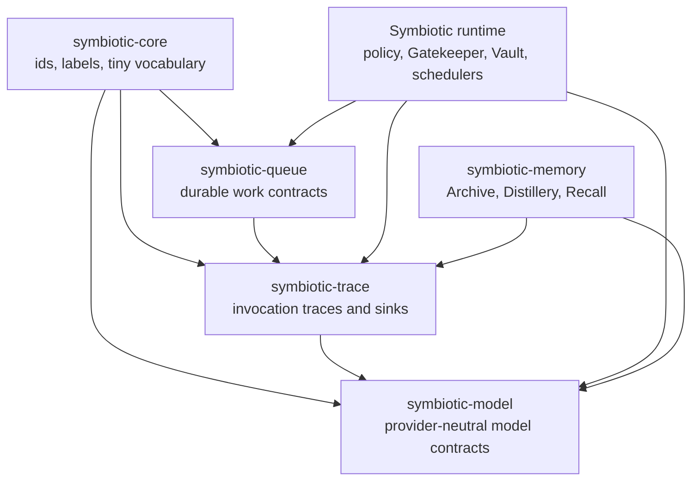

# Symbiotic Foundation Architecture

Status: implemented local foundation, with runtime/memory migration still in progress.

This workspace contains reusable AI execution contracts. It is intentionally
not the Symbiotic product runtime and not the memory engine.

## Why A Separate Repository

The current runtime already has crates named `symbiotic-core`,
`symbiotic-queue`, and `symbiotic-providers`, but those crates were created
inside urgent product and benchmark work. They are valuable evidence, not the
final generic boundary.

This repository rebuilds the foundation directly:

- no dependency on Archive, Distillery, Recall Gateway, Matrix, Gatekeeper, or
  agent role evolution;
- no benchmark-specific or product-specific code;
- small crates with clear ownership;
- host-owned policy and storage through traits.

## Crate Boundaries

### `symbiotic-core`

Owns only tiny stable vocabulary:

- `TraceId`
- `QueueId`
- `QueueItemId`
- `ModelIdentity`
- `RoleBinding`
- `InvocationSource`
- `ModelTier`
- `Sensitivity`

It must not accumulate product behavior.

### `symbiotic-queue`

Owns durable execution vocabulary:

- enqueue;
- claim;
- heartbeat;
- complete;
- fail;
- dead-letter;
- reclaim expired leases;
- queue events.

It must not know about models, prompts, tokens, provider auth, usage, or cost.

The first implementation is a local SQLite backend in this crate. It supports
idempotent enqueue, active-key uniqueness across SQLite handles, claim leases,
lease-owner checks, heartbeat, complete, fail/retry/dead-letter, cooldowns,
expired-lease reclaim, queue events, reopen/resume tests, and multi-connection
claim/idempotency tests.

`complete`, `fail`, and `heartbeat` reject expired leases even if the worker id
still matches. That keeps an old process from acknowledging work after a restart
or lease handoff. A force enqueue may create a new item after a terminal
duplicate, but active duplicates share the existing item.

Apalis, taskmill, and qoxide remain references only unless an adapter proves a
clean fit.

### `symbiotic-model`

Owns provider-neutral model contracts:

- chat;
- embeddings;
- rerank;
- future vision/media/agent-task capabilities;
- provider identity and class;
- auth mode descriptions;
- credential resolution trait;
- provider-neutral errors.

Current implementations include hash/test providers, OpenAI-compatible chat,
Gemini embedding, exact response cache, queue-bound chat/embedding wrappers, and
retry classification. Codex CLI/session and optional `genai` adapters are still
migration targets. The public contract remains ours.

### `symbiotic-trace`

Owns normalized invocation traces:

- model identity;
- queue item reference;
- role binding;
- source;
- sensitivity;
- request/response hashes;
- cache status;
- token/media/cost usage;
- timing;
- outcome;
- audit references;
- pluggable sinks.

This is the central learning tap. The provider/queue layer emits traces, and
the host decides where they go: usage meter, audit log, Archive capture,
Evolution engine, external telemetry, or benchmark artifacts.

Current sinks include JSONL, in-memory, fail-fast fanout, and best-effort
wrapping for model invocation traces. Queue event traces have separate JSONL and
in-memory sinks plus a `QueueEventTraceAdapter` that can be attached to
`symbiotic-queue` event sinks without changing model trace readers.

## Auth Modes

Auth is modeled as provider modes, not as one global OAuth abstraction:

| mode | meaning |
| --- | --- |
| `none` | local or unauthenticated provider such as localhost Ollama |
| `api_key` | secret reference resolves to a bearer/key |
| `oauth_access_token` | secret reference resolves to a refreshable access token |
| `google_adc` | Google Application Default Credentials / service account |
| `oauth_mints_api_key` | OAuth flow returns a provider API key, e.g. OpenRouter |
| `cli_session` | local tool session, e.g. Codex ChatGPT sign-in |

The foundation describes these modes. The product runtime resolves them through
Vault/Gatekeeper or through local trusted tooling.

## Product-Owned Policy

Foundation crates do not decide:

- whether a model may see private content;
- which provider is preferred;
- when budget fallback happens;
- whether a trace is persisted to Archive;
- which traces become training data;
- whether a local CLI session is allowed;
- which credentials can be used by an agent.

Those decisions belong to the host runtime.

## Current Evidence From Symbiotic

The existing runtime crates are useful references:

| existing crate | use as evidence for |
| --- | --- |
| `symbiotic-queue` | idempotency, leases, retry/DLQ vocabulary |
| `symbiotic-providers` | provider traits, Codex/Claude Code local sessions, metering, budgets |
| `symbiotic-agents` | monitor records, Process Engineer learning tools |
| daemon `llm_audit.rs` | LLM audit and Archive trace capture |
| memory benchmark repo | queue/model pressure under high parallel spend |

Do not copy these shapes blindly. Prefer the contracts in this repository and
port only proven behavior.

## Non-Goals

- No Archive or memory fact model.
- No Gatekeeper or credential Vault implementation.
- No Matrix/app event protocol.
- No product-specific agent role evolution.
- No benchmark-specific selectors or scoring logic.
- No global singleton provider registry.
