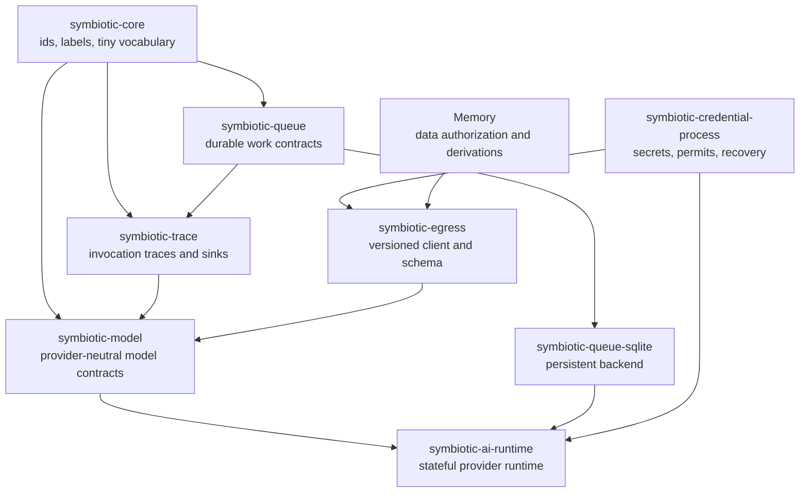

# Symbiotic Foundation Architecture

Status: execution infrastructure implemented; boundary alignment and consumer adoption
remain in progress.

This workspace contains reusable AI execution contracts. It is intentionally
not the Symbiotic product runtime and not the memory engine.

The [Foundation boundary contract](architecture/boundary.md) is authoritative for
ownership, provider-principal authorization, grant-revision ordering, spend,
storage scope and supported modes. This document maps the current crates; existing
APIs still require changes to meet that contract.

## Crate Boundaries

```mermaid
flowchart TB
    Core["symbiotic-core\nids, labels, tiny vocabulary"]
    Queue["symbiotic-queue\ndurable work contracts"]
    Trace["symbiotic-trace\ninvocation traces and sinks"]
    Model["symbiotic-model\nprovider-neutral model contracts"]
    AiRuntime["symbiotic-ai-runtime\nstateful provider runtime"]
    Sqlite["symbiotic-queue-sqlite\npersistent backend"]

    Core --> Queue
    Core --> Trace
    Core --> Model
    Queue --> Trace
    Trace --> Model
    Model --> AiRuntime
    Queue --> Sqlite
    Sqlite --> AiRuntime

    Egress["symbiotic-egress\nversioned client and schema"] --> Model
    Credential["symbiotic-credential-process\nsecrets, permits, recovery"] --> Egress
    Credential --> AiRuntime
    Memory["Memory\ndata authorization and derivations"] --> Egress
```

### `symbiotic-core`

Owns only tiny stable vocabulary:

- `TraceId`
- `QueueId`
- `QueueItemId`
- `ModelIdentity`
- `RoleBinding`
- `InvocationSource`
- `ModelTier`

It must not accumulate product behavior. Existing policy vocabulary outside the
[boundary contract](architecture/boundary.md) is pending cleanup.

### `symbiotic-queue`

Owns durable execution vocabulary:

- enqueue;
- claim;
- heartbeat;
- complete;
- fail;
- dead-letter;
- reclaim expired leases;
- queue events.

It must not know about models, prompts, tokens, provider auth, usage, or cost.

Two backends implement it. `MemoryQueue` lives in this crate: it is
in-process, has no storage dependency and keeps a bounded terminal history.
The local SQLite backend is the separate `symbiotic-queue-sqlite` crate. Both
pass the shared conformance checks (`queue_backend_conformance!`, feature
`conformance`). The contracts above need no storage, and a
separate crate (not a feature) keeps it that way in any build: feature
unification cannot add SQLite to a graph that names only the contracts
(`symbiotic-trace`, `symbiotic-model`'s queue runtime, or a host with its own
queue). The backend supports
idempotent enqueue, active-key uniqueness across SQLite handles, claim leases,
lease-owner checks, heartbeat, complete, fail/retry/dead-letter, cooldowns,
expired-lease reclaim, queue events, reopen/resume tests, and multi-connection
claim/idempotency tests.

`complete`, `fail`, and `heartbeat` reject expired leases even if the worker id
still matches. That keeps an old process from acknowledging work after a restart
or lease handoff. A force enqueue may create a new item after a terminal
duplicate, but active duplicates share the existing item.

Apalis, taskmill, and qoxide remain references only unless an adapter proves a
clean fit.

### `symbiotic-model`

Owns provider-neutral model contracts:

- chat;
- embeddings;
- rerank;
- classification (typed Noul / Choice / Score questions answered with
  probabilities; see [classification](architecture/classification.md));
- future vision/media/agent-task capabilities;
- provider identity and capability descriptions;
- auth mode descriptions;
- credential resolution trait;
- provider-neutral errors.

Current implementations include hash/test providers, OpenAI-compatible chat,
Gemini embedding, TypeSafe System One classification (`JevClassifierProvider`),
chat-backed classification (`ChatClassifierProvider`), a static test
classifier, exact response cache, queue-bound chat/embedding/rerank/classifier
wrappers, and retry classification. Codex CLI/session and optional `genai` adapters are still
migration targets. The public contract remains ours.

The queue-bound wrappers (`QueuedChatProvider`, `QueuedEmbeddingProvider`,
`QueuedRerankProvider`, `QueuedClassifierProvider`) are the default `queue`
feature. With `default-features = false` the crate is the provider contracts
and HTTP providers alone. This build boundary does not authorize consumers to
duplicate Foundation scheduling. Neither configuration links SQLite.
`crates/symbiotic-model/tests/feature_graph.rs` checks the dependency graphs.

Hosts get queued providers from `symbiotic-ai-runtime` (below). Using the
`Queued*` types directly is unsupported outside Foundation.

Known-model execution defaults live in `default_model_queue_config`. The current
DeepSeek `deepseek-flash` name and retained `deepseek-v4-flash` name resolve the
same existing 2,000-request queue policy. This is a configured limit, not a
capacity measurement; execution bindings supply explicit overrides. DeepSeek's
[published account limit](https://api-docs.deepseek.com/quick_start/rate_limit/)
was 2,500 for Flash when checked on September 17, 2026. Request scheduling and
enforcement belong to Foundation execution bindings.

`classify:typesafe:jev-1.13.0` is catalogued with TypeSafe's account limits
(1,200 requests/min, 250,000 tokens/s) and, in `default_model_capabilities`,
an advisory `ModelPricing` of $0.042 per million input tokens with free output.
`ModelCapabilities::pricing` is additive (serde default `None`); it supports
estimates, and provider-reported cost stays in trace metadata. Canonical spend
and monetary guarantees follow the [boundary contract](architecture/boundary.md#spend-ledger-and-budgets).

### `symbiotic-ai-runtime`

The one way hosts run model calls. `Runtime::open(RuntimeConfig { state_dir, .. })`
returns a runtime that hands out ready `Arc<dyn …Provider>`s per binding. It
currently implements queueing, retries, shared limits, cooldowns, attempt budgets,
the response cache, traces, receipts and persistence: SQLite under
`state_dir`, or in memory. Alongside the SQLite backend and credential-process implementation, it
links SQLite; contract crates do not. Explicit tenant/account isolation and the
canonical spend ledger remain boundary-alignment work. Details: [architecture/ai-runtime.md](architecture/ai-runtime.md).

### `symbiotic-egress` and `symbiotic-credential-process`

The versioned WP14 schema/client is `symbiotic-egress`; Memory consumes its
`EgressClient` trait. `symbiotic-credential-process` authenticates Memory's durable
attempt records, issues/consumes single-use permits, resolves local file/keychain
credentials and invokes existing HTTP adapters through `symbiotic-ai-runtime`.
It extends the runtime database with durable replay metadata, has no second scheduler,
and disables response caching. Details: [model egress](architecture/model-egress.md).

### `symbiotic-trace`

Owns normalized invocation traces:

- model identity;
- queue item reference;
- role binding;
- source;
- request/response hashes;
- cache status;
- token/media/cost usage;
- timing;
- outcome;
- audit references;
- pluggable sinks.

This is the central learning tap. The provider/queue layer emits traces, and
the host decides which optional telemetry sinks receive them. Optional usage
telemetry is distinct from Foundation's canonical spend ledger; see the
[boundary contract](architecture/boundary.md#spend-ledger-and-budgets).

Current sinks include JSONL, in-memory, fail-fast fanout, and best-effort
wrapping for model invocation traces. Queue event traces have separate JSONL and
in-memory sinks plus a `QueueEventTraceAdapter` that can be attached to
`symbiotic-queue` event sinks without changing model trace readers.

## Auth Modes

Auth is modeled as provider modes, not as one global OAuth abstraction:

| mode | meaning |
| --- | --- |
| `none` | local or unauthenticated provider such as localhost Ollama |
| `api_key` | secret reference resolves to a bearer/key |
| `oauth_access_token` | secret reference resolves to a refreshable access token |
| `google_adc` | Google Application Default Credentials / service account |
| `oauth_mints_api_key` | OAuth flow returns a provider API key, e.g. OpenRouter |
| `cli_session` | local tool session, e.g. Codex ChatGPT sign-in |

These describe provider authentication, distinct from gateway authentication of
callers. Current file/keychain support is described in
[model egress](architecture/model-egress.md).
The full mode and ownership contract is in
[boundary.md](architecture/boundary.md#supported-modes-and-trusted-channels).

## Policy and integration

See [boundary.md](architecture/boundary.md#ownership) for the ownership contract.
Provider-class metadata is described under
[tenant provider bindings and data access](architecture/boundary.md#tenant-provider-bindings-and-data-access).

## Non-Goals

- No Archive or memory fact model.
- No end-user authentication gateway or general credential platform. The current
  credential backend handles local provider credential injection and recovery.
- No Matrix/app event protocol.
- No product-specific agent role evolution.
- No benchmark-specific selectors or scoring logic.
- No global singleton provider registry.
