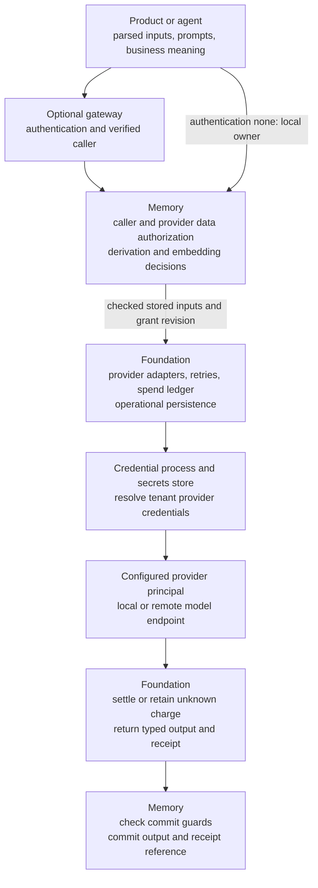

# Foundation boundary contract

Foundation owns model execution and its operational state. Memory owns access to
stored data and commits of derived data. The gateway authenticates callers; products
own business meaning. This is the authoritative contract for those boundaries.
[Architecture](../ARCHITECTURE.md) maps the crates;
[model egress](model-egress.md) and [AI runtime](ai-runtime.md) describe the current
implementation. Their existing APIs do not yet implement every requirement below.

## Ownership

| Owner | Responsibility |
|---|---|
| Foundation | Provider-neutral model calls, provider adapters and capability discovery; credential resolution through the credential process/secrets store; execution queues, account pacing, retries and attempt bounds; the single canonical spend ledger; replay protection, receipts, recovery and operational persistence. |
| Memory | Data authorization for people, agents and provider principals; input and output access checks; registered derivation mechanics and guarded commits; record history, provenance and erasure; decisions about when and what to embed. |
| Gateway | Identity-provider assertions, login challenges, sessions, refresh and timeouts, session revocation, delegation tokens, ingress rate limits and operation-level allow/deny. It supplies a verified caller over a bound trusted channel. |
| Products | Fetching and parsing inputs, ingestion and classification meaning, prompts, result interpretation, registered task definitions and explicit derivation requests. Products register types and policies as data; Memory contains no business logic. |

Foundation does not interpret Memory's record access policies or authenticate end
users. Memory does not keep raw provider credentials, implement provider HTTP
transports, own provider retry queues or maintain a second canonical spend ledger.
The narrow Memory admission adapter conveys checked authority to Foundation without
moving Memory's policy engine into the credential process.

Products may submit their own parsed or derived results. They may also explicitly
request a registered classifier task through `derivations.run`: Memory authorizes
inputs and commits the result; Foundation runs the classifier; the product owns
what its labels and thresholds mean. Memory does not implicitly classify ingestion.
Unsupported provider capabilities return a typed unsupported result. A trait for
OCR, transcription or vision alone does not establish adapter support.

## Tenant provider bindings and data access

A **provider principal** is a tenant-configured local or cloud model endpoint with
an identity and group memberships. It follows the same access rules as a person
or agent. Local, cloud and CLI provider classes confer no special data authority.
Sensitivity labels, processing markings and approved-route policies are not part
of this contract.

Each tenant configures the providers it will use, including its search embedding
and reranking providers. A binding identifies the tenant, provider principal,
model, destination, effective transport configuration and configuration revision.
Calls and receipts also identify the logical invocation and attempt. Secrets are
referenced separately and resolved by Foundation, never carried in model input or
ordinary Memory data. A keyless local binding requires no invented secret.

Endpoint configuration determines the destination; it is not a separate route
allowlist replacing principal grants. Queue/account sharing is explicit in
configuration. Independent tenants or accounts must not accidentally share rate
buckets, cooldowns or spend budgets. Deduplication and result reuse must bind the
tenant, provider and effective configuration; sharing a model name is insufficient.

With `access_control: off`, every principal, including providers, can read all
of its tenant's data. Configuring only local providers keeps Memory-run calls local.
With `access_control: on`, a Memory-run model call checks both the requesting
principal and the provider against every stored input. This includes contextual
fields supplied alongside an embedding. A field with embedding disabled is never
embedded. Embedding is asynchronous: the write is acknowledged before embedding,
and search readiness is a separate state. Memory chooses the embedding work;
Foundation schedules and executes the provider calls.

Query text sent for search embedding or reranking has no per-query access check:
it goes to the tenant's configured search providers. Configure local search
providers when queries must stay local. This exemption covers query text only.
Candidate record text in a reranking payload requires the requesting principal's
and reranker principal's read access. A candidate the caller may read but the
reranker may not read stays in the results at its first-stage position, is not
reranked, and is flagged `rerank: skipped`. Nothing about that candidate is sent
to the reranker provider; query exemption does not authorize the complete payload.

For example, tenant A searches for `renewal date`. That text may go to its configured
search provider without a query grant. If candidate revision R is readable by the
caller but not by the reranker, Memory returns R at its first-stage position with
`rerank: skipped` and sends nothing about R in the reranking request.
If both have access, Foundation executes the admitted payload, and Memory stores
any resulting derivation with a receipt reference and checked input provenance.

Without an explicit release, derived output is readable by at most the intersection
of its inputs' readers. Widening requires an explicit Memory release grant: a
principal with release authority grants a specified reader set for the derived
record, which may include a provider principal. Memory updates that record's reader
set and the effective grant revision. The explicit release stands until changed by
another explicit release; later input-grant changes do not recompute its reader set.
The automatic input-intersection rule applies only to outputs without an explicit
release and carries provider restrictions into those outputs.
Initial readers for outputs using only product-supplied inputs are defined by
[Memory's redesign](https://github.com/symbiotic-sh/symbiotic-memory/issues/545).
Once data is returned to an agent, Memory cannot control which model that agent
subsequently uses.

## Grant revision and dispatch ordering

A **grant revision** identifies the current effective authorization of both the
requesting principal and the provider against the stored inputs. It covers their
authorization dependencies, including group memberships, group-derived grants
and input access rules. It is the linearization point: changes to either
principal's input authorization and dispatch acceptance must be ordered against
the same current revision. An old signed admission or issued permit is not
continuing permission to dispatch.

The ordered call contract is:

1. Memory checks the requesting principal and provider against all stored inputs
   and binds the signed admission to the effective grant revision, exact invocation
   inputs and an exclusive authority deadline covering the earliest applicable
   expiry of either principal's authority and its authorization dependencies.
2. Pending admissions, including queued work and retries, re-check the current
   grant revision for both the requesting principal and provider before dispatch.
   A changed revision requires current authorization of both against all stored
   inputs; a call no longer authorized is refused.
3. Foundation accepts a handoff only after the revision check is ordered with grant
   updates and its own clock is strictly before the signed authority deadline.
   Foundation checks that deadline inside the acceptance transaction, before permit
   consumption or reservation, and makes the attempt's reservation/replay state durable.
   An expired pending attempt is refused with a typed error, consumes no permit or
   attempt allowance, reserves nothing and is not a charge. Reauthorization can
   admit a new attempt for that invocation even without a grant revision change.
   The handoff is
   the acceptance of that specific provider attempt, not enqueue or permit issuance.
4. Foundation executes the accepted attempt and preserves its accounting and
   recovery state. Later revocation or authority expiry does not withdraw that accepted handoff or
   imply that data already sent can be recalled.
5. Memory checks current commit guards and output authority before committing a
   derivation. Execution success alone does not authorize an output commit.

The revision check and handoff must not leave a race in which either principal's
input authorization has changed but pending work can still dispatch under an old
revision. The trusted admission integration must establish this ordering;
wall-clock timestamps or asynchronous revocation notification alone do not
establish revision ordering. Ordinary authority expiry need not publish a grant
revision: the signed deadline independently closes the delay between Memory's
check and Foundation's acceptance. All protocol timestamps use absolute Unix
seconds (UTC), including record times, authority deadlines and recovery deadlines;
deadlines are exclusive. The v3 signed/digested `DurableAttempt.expires_at` carries
the authority deadline; `recovery_expires_at` separately bounds terminal-result recovery.

For example, Memory checks attempt D at Unix second 100 with `expires_at = 101`.
IPC or admission delay reaches Foundation's acceptance at second 101 or later.
Foundation refuses D with `AuthorityExpired` before consuming its permit or
reserving a request. A newly authorized attempt with the next ordinal, higher
record sequence and fresh deadline may proceed under the same grant revision.
Unissued attempts may leave ordinal gaps. Once a successor is issued, its unconsumed
predecessor remains invalidated even if the clock rolls back before its deadline.
An attempt accepted at second 100 keeps its execution, accounting and recovery
after second 101; a retry requires a new authority check and deadline.

For example, attempt A waits under revision 10. Removing the provider's input grant
publishes revision 11 before A's handoff is accepted. A is refused even if its
permit was issued under revision 10. Attempt B accepted before revision 11 may
finish; Foundation keeps B's spend and receipt. A retry of B is a new handoff and
must check revision 11.

Likewise, if the caller loses access to an input while attempt C is queued,
the grant revision changes even when the provider's grants remain unchanged.
C is refused before handoff; a later commit check cannot undo disclosure to
the provider.

Grant changes apply going forward. Stored outputs remain. Outputs without an
explicit release follow the input-intersection rule, so a provider that loses read
access to an input loses read access to those outputs. An explicitly released
output retains its specified readers, including provider principals, until another
explicit release changes them.

For example, provider P is an explicit reader of derived record D under a release
grant. Removing P's access to an input of D does not remove P's access to D; another
explicit release must change D's readers to do that. An output with the same inputs
but no explicit release loses P through the input-intersection rule.

The audit trail stays global. Read authority across tenants is defined by
[Memory's redesign](https://github.com/symbiotic-sh/symbiotic-memory/issues/545).
Changing the embedding provider triggers re-embedding. Re-embedding failure and
search readiness across embedding generations are defined by
[Memory's redesign](https://github.com/symbiotic-sh/symbiotic-memory/issues/545).
Products that want to regenerate
old outputs page `derivations.list` by producer and explicitly request new runs.

## Spend ledger and budgets

Foundation owns one durable spend ledger for tenant/account reservations,
settlement and recovery. Memory stores Foundation receipt references with its
derivation effects and provenance. Trace sinks, usage telemetry and Memory's
commit records are not alternative canonical accounting stores.

Before accepting an attempt, Foundation durably reserves its enforceable charge
bound. It records the attempt identity so replay or a lost reply cannot allocate
a second dispatch or account for the same attempt twice. A known pre-transport
zero-charge failure can release the reservation; success settles measured usage.
Timeouts, uncertain provider failures and crashes retain an unknown charge and its
reservation until reconciliation. Missing usage is unknown, never fabricated zero.
Output-commit refusal in Memory does not release spend already incurred.

A lost dispatch reply is recovered by authenticated same-attempt status/receipt
lookup. It does not authorize replaying the provider request. Unknown external
outcomes stop automatic resubmission and require reconciliation. Single-use permits
protect Foundation handoff; they do not promise exactly-once external execution.
The local backend describes its [unresolved-request guard](model-egress.md#shared-direct-request-failure-budget),
[recovery status](model-egress.md#same-attempt-recovery-v4),
and [replay rules](model-egress.md#revocation-replay-and-unknown-charges).

Dispatch requires an explicit runtime `state_dir`; `Runtime::in_memory()` and
`state_dir: None` refuse with the typed `SpendLedgerUnavailable` error. Foundation
does not invent a default persistence path.

This rule applies to every Foundation execution path, including runtime calls
outside the credential process. Automatic retry requires evidence that the failed
attempt was pre-transport or otherwise known zero-charge. An attempt whose transport
may have started is never blindly resent: an uncertain timeout or other unknown
outcome enters Foundation's same-attempt recovery and reconciliation path. An error
class or unused attempt allowance alone does not establish that retry is safe.
The current retry-class inventory is in [AI runtime](ai-runtime.md#policy-knobs).
The shared queued chat, embedding, rerank and classification paths retain unknown
charge after uncertain raw-provider failures and stop retries regardless of error class
or unused attempt allowance. A trusted adapter may explicitly establish KnownZero;
only that evidence permits release and retry. Credential permit consumption and ledger reservation are
one immediate SQLite transaction; completion and accounting settlement are also
atomic. The version-3 Memory-facing protocol returns the accepted attempt identity and a typed
Foundation receipt reference. Its spend state is a ledger observation, never a consumer
reservation or settlement instruction. The local backend orders authenticated grant
revision publication with acceptance as described in [model egress](model-egress.md#revocation-replay-and-unknown-charges).

For example, a request-bound invocation allows at most two provider requests. One
attempt is accepted, then times out after transport starts. Foundation retains its
reservation as unknown and returns recovery status; Memory stores the receipt
reference without committing an absent result. The unused second request does
not justify automatically retrying an uncertain first attempt.

Enforceable provider-request and attempt bounds are advertised separately from
measured or estimated money. Token counts, catalogue tariffs and provider-reported
cost may support monetary reporting, but an estimate is not an upper reservation.
No hard dollar ceiling is promised until an enforceable monetary reservation
contract is chosen. The current credential backend supports one provider request
per permit, finite invocation/attempt limits and no monetary budget unit; see
[model egress](model-egress.md#revocation-replay-and-unknown-charges).

## Storage and credentials

Memory's canonical data store is zvec. That choice does not constrain Foundation's
operational persistence: queue and attempt state, spend reservations, replay
records and recovery receipts are separate from Memory's canonical records.
Foundation may use SQLite for this state. It is not a second Memory database or
a duplicate data authorization engine.

Integration/provider credentials remain in the secrets store, accessed through
Foundation's credential boundary. Removing field-level encryption from Memory
does not remove provider secret protection. Secrets must not enter prompts,
protocol replies, tracked configuration values, ordinary logs or raw diagnostics.
Encryption at rest and physical deployment protections are the deployer's choice.
Memory access control protects callers of its API, not actors who can read its files.

Use the current state format only; there are no pre-release migration or legacy
reader requirements. Re-ingest rebuildable data from raw inputs. Unresolved paid
attempts must be reconciled before retiring replay/accounting state: rebuilding a
cache or Memory index does not authorize forgetting an uncertain provider charge.
Invalidation of cached and recoverable output when an input is erased before its
recovery deadline is defined by
[Memory's redesign](https://github.com/symbiotic-sh/symbiotic-memory/issues/545).

## Supported modes and trusted channels

Foundation supports embedded and service use, local and remote provider bindings,
and keyless providers. Model execution does not require end-user login. Provider
authentication (such as an API key) is distinct from gateway authentication of callers.
The current backend's transport and capability limits are documented in
[model egress](model-egress.md#deployment-and-credentials); required adapter work
must pass through the same execution boundary.

Memory's instance setting is `authentication: none | gateway`, with a separate
`access_control` setting. These are Memory settings, not new Foundation API fields.

| Authentication | Access control | Caller contract |
|---|---|---|
| `none` | off | Single tenant and stable local owner, created atomically on first open. Every caller able to reach the API has owner authority; supplied credentials are refused with `AuthenticationNotConfigured`, and public `tenants.create` is refused. Agent names are provenance labels. |
| `gateway` | off | Only the configured gateway's authenticated channel attaches a verified caller; all tenant principals have data access. |
| `gateway` | on | The gateway supplies verified identity; Memory checks caller and provider data access. |
| `none` | on | Refused with `ModeConstraint`. |

Public clients cannot set the optional verified caller envelope. Gateway mode
requires a bound authenticated channel (for example, Unix peer credentials or
mutual TLS). Gateway revocation must cut off the caller's open feeds/streams;
its detailed stream contract belongs to the gateway, not the model scheduler.
Audit records distinguish local unverified and gateway-verified identity.

Switching from `none` to `gateway` requires an exclusive reopen, draining streams
and tasks and attaching the existing tenant/owner. Data is unchanged and history
is never retroactively authenticated. Switching to `none` is refused with multiple
tenants or access control enabled.

The Unix, same-UID credential process with owner-only files is one supported local
backend. Its requirements apply when that backend is chosen. They do not prescribe
OS users, hosts, sandboxes, file layout or transport for every deployment. Other
trusted transports require implementation and qualification when a deployment
needs them; the boundary contract does not claim they already exist.

## Bounds as labelled settings

A general claim that the runtime is bounded requires explicit admission and
maintenance settings. Each setting must state its unit, scope, default (or required
explicit value), enforcement point, hard versus soft behavior, and benchmark or
reasoning basis. Unmeasured values are labelled provisional settings, not proven
capacity or operator-chosen constants. Raising a qualified limit needs evidence
at the new size.

| Setting family | Required distinction |
|---|---|
| Pending admission | Count and bytes; refuse before exceeding a hard admission bound. An in-flight concurrency cap alone does not bound pending work. |
| Request/response | Encoded input, response and frame bytes, output tokens, timeouts and total attempts; enforced at the applicable admission/transport boundary. |
| Cache | Age and byte settings; label sweep-based targets as soft limits. A hard byte bound requires enforcement before allocation/write, not a later sweep. |
| Maintenance | Items/bytes processed per batch and idle cadence; retained history must not turn one request into an unbounded scan. |
| Account execution | Concurrency and pacing settings with explicit account sharing; distinguish configured limits from measured capacity. |

Existing runtime retention defaults are documented in [AI runtime](ai-runtime.md#persistence).
They do not establish pending count/byte bounds, hard cache admission or incremental
idle maintenance. Those remain implementation work under this contract; this
contract introduces no arbitrary numeric defaults.
